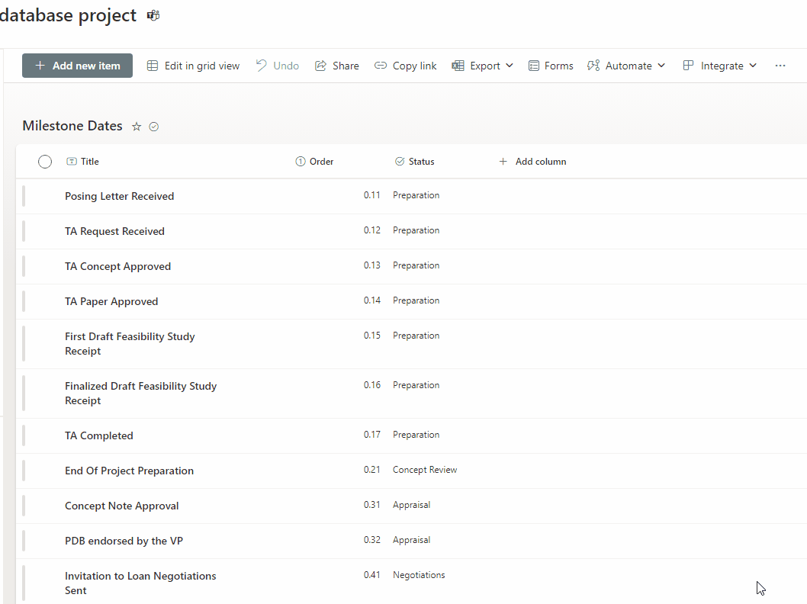
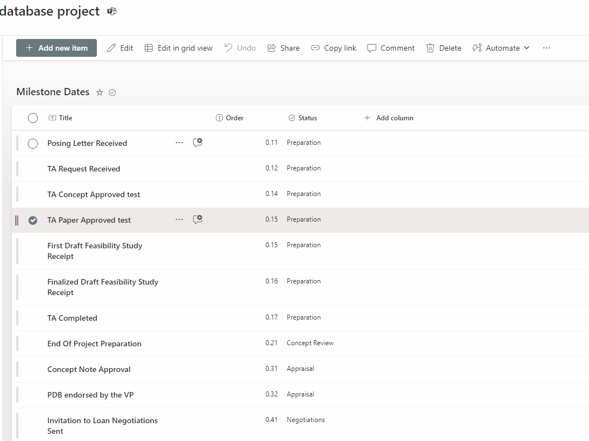

# SPFX Application Customizer to block display form into edit mode

  

## Summary

  

As you may know, in SharePoint modern experience, end user can edit list item/document property on display form directly without go to edit form. 
It will go to edit mode if user click the field control and it would save automatically if user change anything (However,in edit form, the change won't be saved until user click **save button**. )

  

This "feature" would have some side effects:

- List item would have many many versions because each change on field control in display form would be saved as an individual version, which makes versioning control in a mess (Document item has major/minor version so it is not a big problem)

- User may do some changes by mistake and cannot discard easily (have to go to versioning history and revert version)

  

This SPFX Application Customizer will block display form into edit mode.

  

You can use **blockAddressRegex** this client compononent property to specify the list or document library you want to block.If you keep this property empty, it will block all lists and libraries.

### How to set this parameter
Usually SharePoint list url will contains **/Lists/{ListName}** while document library will contains **/LibraryName/Forms/**
Here are some common cases you can refer:

| Use Case | blockAddressRegex value |
|--|--|
| to block list **List1** and **My List2** | `\/Lists\/(List1\|My%20List2)\/` |
| to block document library **My Files** | `\/My%20Files\/Forms\/` |
| to block document library **My Files** and lists **List1** and **My List** | `\/(My%20Files\/Forms\|Lists\/(List1\|My%20List))\/` |
| to block all lists | `\/Lists\/` |
| to block all libraries | `\/Forms\/` |

You can test the regex in brower console like this
> var reg = RegExp("{value}")
> reg.test(window.location.pathname)

  You can use this following command to change **blockAddressRegex** value.
```
Set-PnPApplicationCustomizer -ClientSideComponentId 1336bf0a-3656-48c6-89e2-675a8b2578dd -Scope web -ClientSideComponentProperties "{`"blockAddressRegex`":`"{value}`"}"
``` 

  

## How it work

This solution use Jquery to block the click event on display form field control on specified list/library.

This code will overwrite the existing click event to stop it into edit mode.

```js

$(".ReactFieldEditor-core--display").on("click", (event) => {

event.preventDefault(); // Prevent the default action

event.stopPropagation(); // Stop the event from propagating

});

```

"display form field control" is the control whose class name is **ReactFieldEditor-core--display**, it need adjust if microsoft change the UI (It already occurred last year switched from panel to dialog)

## Combine with Form Customizer (Dynamic Form Control)
Field control in [Dynamic Form](https://pnp.github.io/sp-dev-fx-controls-react/controls/DynamicForm/) is not as fancy as default control. So usually I just enable **Form Customizer** on new and edit form and keep the display form as it is. 
However end user can still do editing in display form, in this case, this spfx application customizer will force user to use edit form.